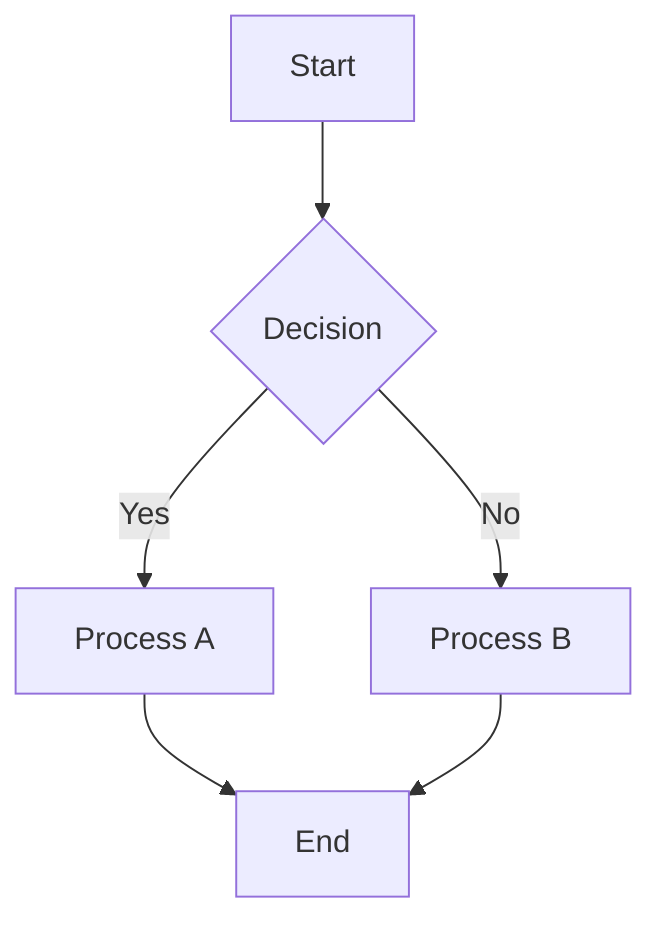
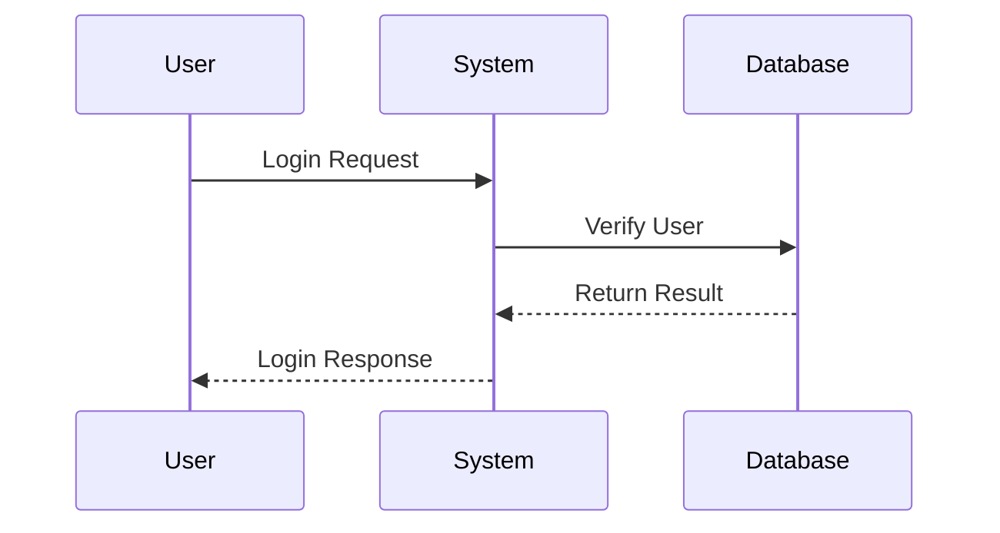
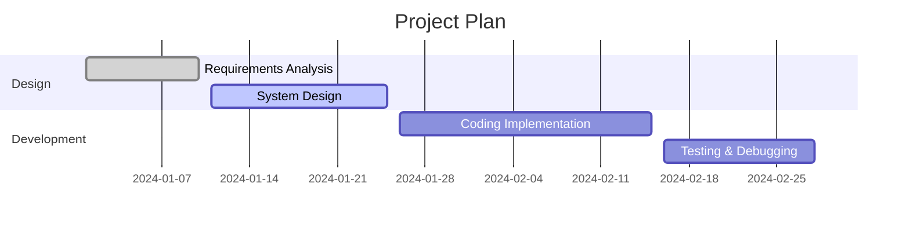
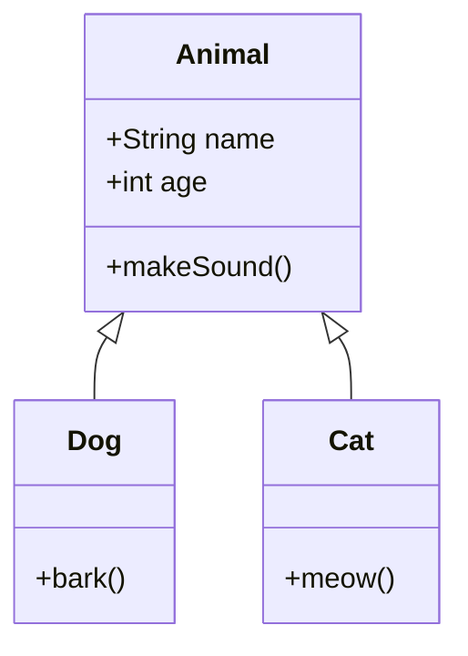
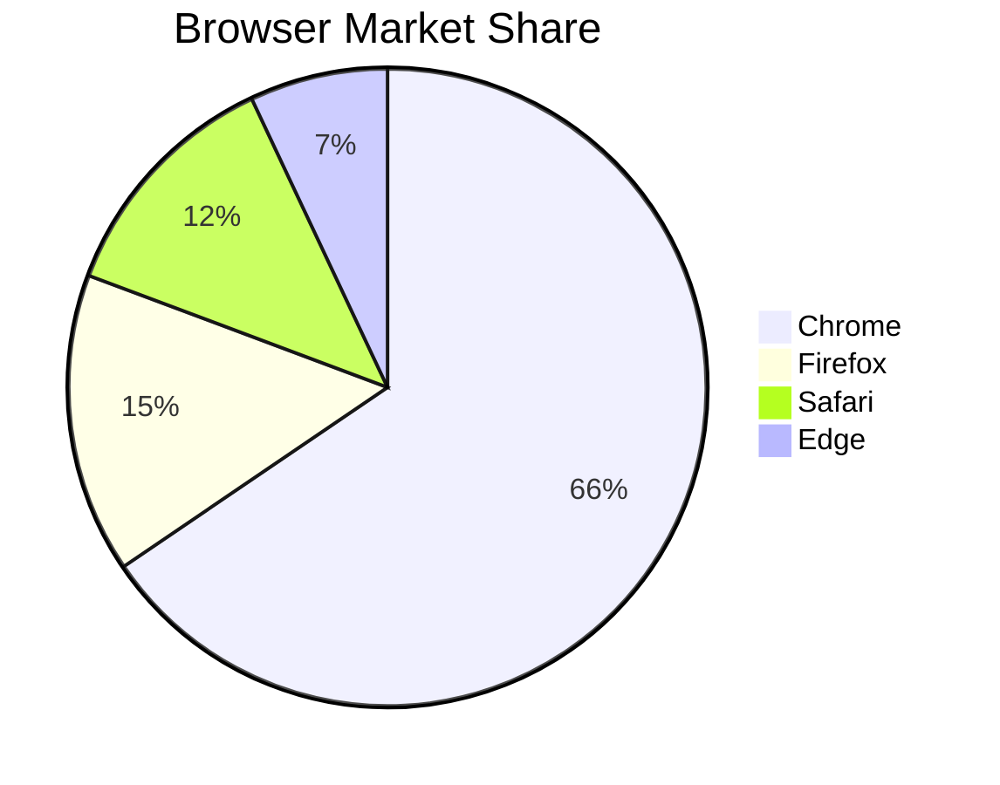
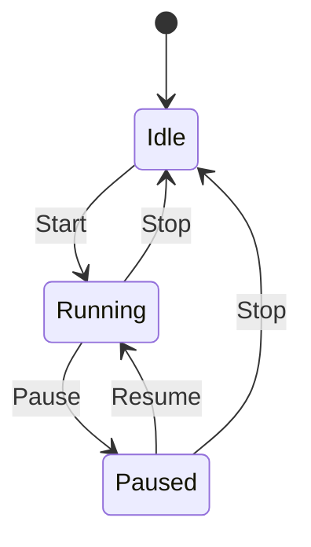

# ds-markdown-mermaid-plugin

🚀 **Mermaid Chart Rendering Plugin Optimized for AI Streaming Data**

A React plugin for [ds-markdown](https://github.com/onshinpei/ds-markdown) that provides Mermaid chart rendering functionality, specially optimized for AI streaming output scenarios.

[🔄 Live Demo](https://stackblitz.com/edit/vitejs-vite-iqbyta3j?file=README.md) | [🇨🇳 中文](./README.md)


## ✨ Core Features

- 🎯 **AI Streaming Optimization** - Intelligent detection of streaming data completeness, supports real-time chart building
- 🚀 **High Performance Rendering** - Built on Mermaid 11.x with excellent rendering performance
- 🎨 **Theme Support** - Supports multiple Mermaid theme configurations
- 📊 **Rich Chart Types** - Supports flowcharts, sequence diagrams, Gantt charts, class diagrams, pie charts, state diagrams, and more
- 🔧 **Highly Configurable** - Supports custom Mermaid configuration options
- 📱 **Responsive Design** - Supports fullscreen mode, zoom/pan, export, and other features
- 🌍 **Internationalization** - Complete multi-language support

## 🎯 AI Streaming Data Scenarios

This plugin is particularly suitable for the following AI scenarios:

- **AI Chat Applications** - Real-time rendering of AI-generated chart code
- **Document Generation** - Dynamic updates of system architecture diagrams and flowcharts
- **Education & Training** - Real-time concept maps and learning flowcharts
- **Collaboration Tools** - Chart collaboration with streaming output support

## 📦 Installation

```bash
npm install ds-markdown-mermaid-plugin
```

Or using yarn:

```bash
yarn add ds-markdown-mermaid-plugin
```

## 🚀 Quick Start

### Basic Usage

```tsx
import React from 'react';
import { ConfigProvider, Markdown } from 'ds-markdown';
import plugin from 'ds-markdown-mermaid-plugin';
import 'ds-markdown/style.css';

const App = () => {
  const markdownContent = `
# Flowchart Example

\`\`\`mermaid
flowchart TD
    A[Start] --> B{Decision}
    B -->|Yes| C[Process A]
    B -->|No| D[Process B]
    C --> E[End]
    D --> E
\`\`\`
`;

  return (
    <ConfigProvider>
      <Markdown plugins={[plugin]}>{markdownContent}</Markdown>
    </ConfigProvider>
  );
};

export default App;
```

### AI Streaming Data Rendering

```tsx
import React, { useState, useEffect } from 'react';
import { ConfigProvider, Markdown } from 'ds-markdown';
import plugin from 'ds-markdown-mermaid-plugin';
import 'ds-markdown/style.css';

const AIStreamingExample = () => {
  const [streamingContent, setStreamingContent] = useState('');

  // Simulate AI streaming output
  useEffect(() => {
    const content = `
# AI Generated System Architecture

\`\`\`mermaid
graph TD
    A[User Interface] --> B[API Gateway]
    B --> C[Authentication Service]
    B --> D[Business Service]
    D --> E[Database]
    D --> F[Cache Service]
\`\`\`
`;

    // Simulate streaming output
    let index = 0;
    const timer = setInterval(() => {
      if (index < content.length) {
        setStreamingContent(content.slice(0, index + 1));
        index++;
      } else {
        clearInterval(timer);
      }
    }, 50);

    return () => clearInterval(timer);
  }, []);

  return (
    <ConfigProvider>
      <Markdown
        plugins={[plugin]}
        interval={16} // Streaming output interval
        disableTyping={false} // Enable typewriter effect
      >
        {streamingContent}
      </Markdown>
    </ConfigProvider>
  );
};

export default AIStreamingExample;
```

### Configure Mermaid Theme

```tsx
import React from 'react';
import { ConfigProvider, Markdown } from 'ds-markdown';
import plugin from 'ds-markdown-mermaid-plugin';
import 'ds-markdown/style.css';

const App = () => {
  const markdownContent = `
\`\`\`mermaid
sequenceDiagram
    participant User
    participant System
    participant Database

    User->>System: Login Request
    System->>Database: Verify User
    Database-->>System: Return Result
    System-->>User: Login Response
\`\`\`
`;

  // Configure Mermaid
  const mermaidConfig = {
    theme: 'dark', // Supports 'default', 'dark', 'forest', 'neutral', etc.
    flowchart: {
      useMaxWidth: true,
      htmlLabels: true,
    },
    sequence: {
      showSequenceNumbers: true,
    },
  };

  return (
    <ConfigProvider mermaidConfig={mermaidConfig}>
      <Markdown plugins={[plugin]}>{markdownContent}</Markdown>
    </ConfigProvider>
  );
};

export default App;
```

## 📊 Supported Chart Types

### Flow Diagram (Flowchart)



### Sequence Diagram



### Gantt Chart



### Class Diagram



### Pie Chart



### State Diagram



## 🔧 Complete API Documentation

### Plugin Export

```tsx
import plugin from 'ds-markdown-mermaid-plugin';
```

### Component Export

```tsx
import {
  MermaidBlock, // Main chart component
  rehypeMermaid, // rehype plugin
  MermaidService, // Mermaid service
  mermaid, // Mermaid instance
} from 'ds-markdown-mermaid-plugin';
```

### Type Definitions

````tsx
interface MermaidProps {
  /** Mermaid chart code */
  code: string;
  /** Whether the code is complete (has ending ``` marks) */
  isComplete?: boolean;
  node: any;
}

interface RehypeMermaidOptions {
  /** Custom mermaid configuration */
  mermaidConfig?: MermaidConfig;
}
````

### Configuration Options

```tsx
const mermaidConfig = {
  // Theme configuration
  theme: 'default', // 'default' | 'dark' | 'forest' | 'neutral'

  // Flowchart configuration
  flowchart: {
    useMaxWidth: true,
    htmlLabels: true,
    curve: 'basis',
  },

  // Sequence diagram configuration
  sequence: {
    showSequenceNumbers: true,
    actorMargin: 50,
  },

  // Gantt chart configuration
  gantt: {
    titleTopMargin: 25,
    barHeight: 20,
  },

  // Whether to show action bar
  headerActions: true,
};
```

## 🎨 Advanced Features

### Fullscreen Mode

The plugin automatically supports fullscreen viewing. Click the fullscreen button to enter fullscreen mode, supporting:

- Large image display
- Zoom and pan
- Image export
- Clipboard copy

### Export Features

Supports multiple export methods:

- **PNG Download** - High-quality image download
- **Clipboard Copy** - One-click copy to clipboard
- **SVG Get** - Get original SVG code

### Interactive Features

- **Zoom Control** - Supports mouse wheel and button zoom
- **Pan Operation** - Drag to move chart view
- **Adaptive Fitting** - Automatically adapts to container size

## 📝 Complete Examples

Check the [example](./example/) directory for complete usage examples.

### Running Examples

```bash
# Install dependencies
npm install

# Start development server
npm run dev

# Build examples
npm run build:demo
```

### Project Structure

```
src/
├── MermaidBlock/           # Main chart component
│   ├── RenderGraph/        # Chart rendering logic
│   ├── RenderCode/         # Code display
│   ├── components/         # Sub components
│   └── utils/              # Utility functions
├── plugin.ts               # Main plugin file
├── rehypeMermaid.ts        # rehype plugin
├── remarkMermaid.ts        # remark plugin
├── mermaidService.ts       # Mermaid service
└── types.ts                # Type definitions
```

## 🔍 Technical Principles

This plugin is built on the following technology stack:

- **Mermaid 11.x** - Chart rendering engine
- **React 18+** - UI framework
- **unified/rehype/remark** - Markdown parsing ecosystem
- **TypeScript 5.0+** - Type safety
- **svg-pan-zoom** - Chart interaction

### Core Process

1. **Markdown Parsing** - Detect code block completeness through remark plugin
2. **Code Recognition** - rehype plugin recognizes Mermaid code blocks
3. **Component Conversion** - Convert to MermaidBlock component
4. **Chart Rendering** - Use MermaidService to render charts
5. **Interaction Enhancement** - Add zoom, pan, export, and other features

## 🤝 Contributing

Welcome to contribute code! Please follow these steps:

1. Fork this repository
2. Create a feature branch (`git checkout -b feature/AmazingFeature`)
3. Commit your changes (`git commit -m 'Add some AmazingFeature'`)
4. Push to the branch (`git push origin feature/AmazingFeature`)
5. Open a Pull Request

## 📄 License

This project is licensed under the MIT License - see the [LICENSE](LICENSE) file for details.

## 🔗 Related Links

- [ds-markdown](https://github.com/onshinpei/ds-markdown) - Main project
- [Mermaid](https://mermaid.js.org/) - Chart library
- [React](https://reactjs.org/) - UI framework

## 📞 Support & Feedback

If you encounter any issues or have suggestions, welcome to:

- 📝 [Submit Issue](https://github.com/your-username/ds-markdown-mermaid-plugin/issues)
- 💬 [Join Discussion](https://github.com/your-username/ds-markdown-mermaid-plugin/discussions)
- ⭐ [Give a Star](https://github.com/your-username/ds-markdown-mermaid-plugin)

---

**Make AI-generated charts more vivid!** 🎨✨
