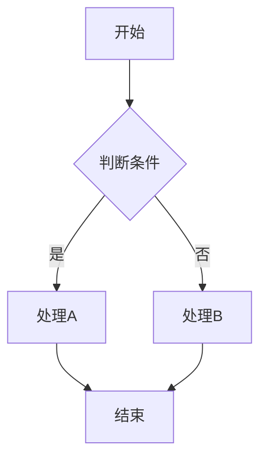
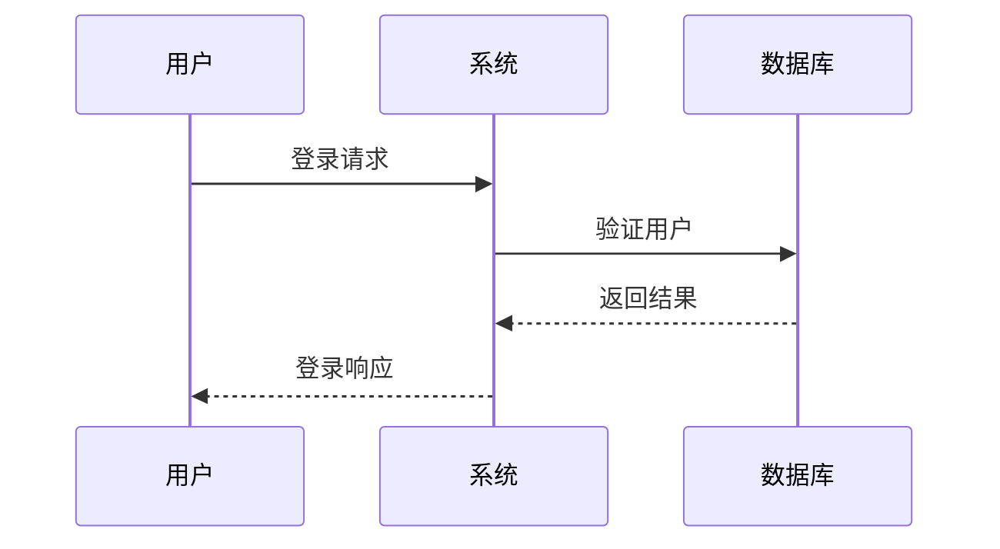
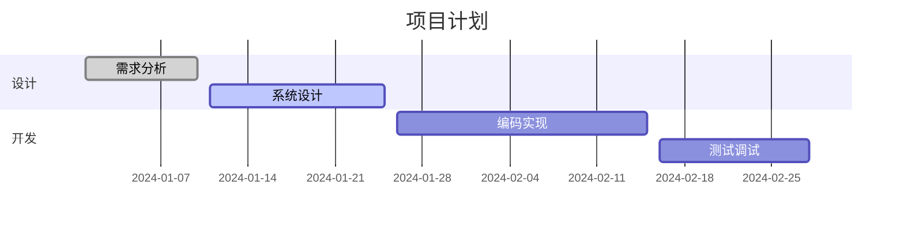
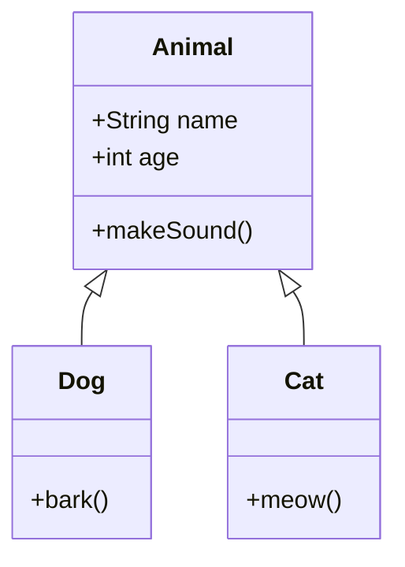
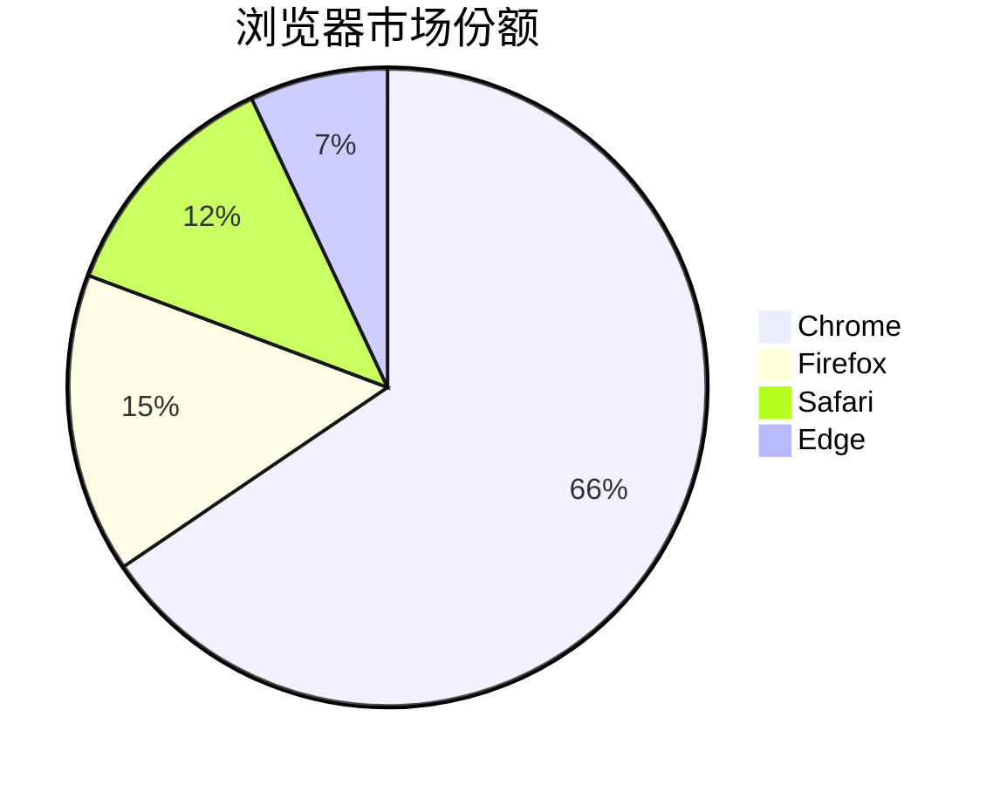
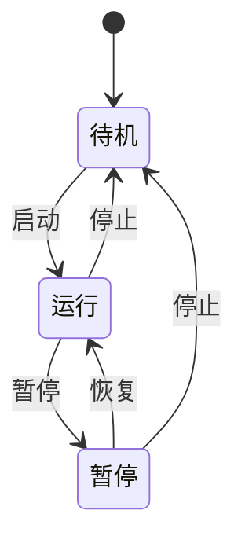

# ds-markdown-mermaid-plugin

🚀 **专为AI流式数据设计的Mermaid图表渲染插件**

一个为 [ds-markdown](https://github.com/onshinpei/ds-markdown) 提供 Mermaid 图表渲染功能的 React 插件，特别优化了AI流式输出场景下的图表渲染体验。

[🔄 在线演示](https://stackblitz.com/edit/vitejs-vite-iqbyta3j?file=README.md) | [🇺🇸 English](./README.en.md)


## ✨ 核心特性

- 🎯 **AI流式优化** - 智能检测流式数据的完整性，支持实时图表构建
- 🚀 **高性能渲染** - 基于 Mermaid 11.x，渲染性能优秀
- 🎨 **主题支持** - 支持 Mermaid 的多种主题配置
- 📊 **图表类型丰富** - 支持流程图、序列图、甘特图、类图、饼图、状态图等
- 🔧 **高度可配置** - 支持自定义 Mermaid 配置选项
- 📱 **响应式设计** - 支持全屏模式、缩放平移、导出等功能
- 🌍 **国际化支持** - 完整的多语言支持

## 🎯 AI流式数据场景

本插件特别适用于以下AI场景：

- **AI对话应用** - 实时渲染AI生成的图表代码
- **文档生成** - 动态更新系统架构图和流程图
- **教育培训** - 实时的概念图和学习流程图
- **协作工具** - 支持流式输出的图表协作

## 📦 安装

```bash
npm install ds-markdown-mermaid-plugin
```

或者使用 yarn：

```bash
yarn add ds-markdown-mermaid-plugin
```

## 🚀 快速开始

### 基本用法

```tsx
import React from 'react';
import { ConfigProvider, Markdown } from 'ds-markdown';
import plugin from 'ds-markdown-mermaid-plugin';
import 'ds-markdown/style.css';

const App = () => {
  const markdownContent = `
# 流程图示例

\`\`\`mermaid
flowchart TD
    A[开始] --> B{判断条件}
    B -->|是| C[处理A]
    B -->|否| D[处理B]
    C --> E[结束]
    D --> E
\`\`\`
`;

  return (
    <ConfigProvider>
      <Markdown plugins={[plugin]}>{markdownContent}</Markdown>
    </ConfigProvider>
  );
};

export default App;
```

### AI流式数据渲染

```tsx
import React, { useState, useEffect } from 'react';
import { ConfigProvider, Markdown } from 'ds-markdown';
import plugin from 'ds-markdown-mermaid-plugin';
import 'ds-markdown/style.css';

const AIStreamingExample = () => {
  const [streamingContent, setStreamingContent] = useState('');

  // 模拟AI流式输出
  useEffect(() => {
    const content = `
# AI生成的系统架构图

\`\`\`mermaid
graph TD
    A[用户界面] --> B[API网关]
    B --> C[认证服务]
    B --> D[业务服务]
    D --> E[数据库]
    D --> F[缓存服务]
\`\`\`
`;

    // 模拟流式输出
    let index = 0;
    const timer = setInterval(() => {
      if (index < content.length) {
        setStreamingContent(content.slice(0, index + 1));
        index++;
      } else {
        clearInterval(timer);
      }
    }, 50);

    return () => clearInterval(timer);
  }, []);

  return (
    <ConfigProvider>
      <Markdown
        plugins={[plugin]}
        interval={16} // 流式输出间隔
        disableTyping={false} // 启用打字机效果
      >
        {streamingContent}
      </Markdown>
    </ConfigProvider>
  );
};

export default AIStreamingExample;
```

### 配置 Mermaid 主题

```tsx
import React from 'react';
import { ConfigProvider, Markdown } from 'ds-markdown';
import plugin from 'ds-markdown-mermaid-plugin';
import 'ds-markdown/style.css';

const App = () => {
  const markdownContent = `
\`\`\`mermaid
sequenceDiagram
    participant 用户
    participant 系统
    participant 数据库

    用户->>系统: 登录请求
    系统->>数据库: 验证用户
    数据库-->>系统: 返回结果
    系统-->>用户: 登录响应
\`\`\`
`;

  // 配置 Mermaid
  const mermaidConfig = {
    theme: 'dark', // 支持 default, dark, forest, neutral 等主题
    flowchart: {
      useMaxWidth: true,
      htmlLabels: true,
    },
    sequence: {
      showSequenceNumbers: true,
    },
  };

  return (
    <ConfigProvider mermaidConfig={mermaidConfig}>
      <Markdown plugins={[plugin]}>{markdownContent}</Markdown>
    </ConfigProvider>
  );
};

export default App;
```

## 📊 支持的图表类型

### 流程图 (Flowchart)



### 序列图 (Sequence Diagram)



### 甘特图 (Gantt Chart)



### 类图 (Class Diagram)



### 饼图 (Pie Chart)



### 状态图 (State Diagram)



## 🔧 完整API文档

### 插件导出

```tsx
import plugin from 'ds-markdown-mermaid-plugin';
```

### 组件导出

```tsx
import {
  MermaidBlock, // 主要图表组件
  rehypeMermaid, // rehype插件
  MermaidService, // Mermaid服务
  mermaid, // Mermaid实例
} from 'ds-markdown-mermaid-plugin';
```

### 类型定义

````tsx
interface MermaidProps {
  /** Mermaid图表代码 */
  code: string;
  /** 代码是否完整（是否有结束的```标记） */
  isComplete?: boolean;
  node: any;
}

interface RehypeMermaidOptions {
  /** 自定义mermaid配置 */
  mermaidConfig?: MermaidConfig;
}
````

### 配置选项

```tsx
const mermaidConfig = {
  // 主题配置
  theme: 'default', // 'default' | 'dark' | 'forest' | 'neutral'

  // 流程图配置
  flowchart: {
    useMaxWidth: true,
    htmlLabels: true,
    curve: 'basis',
  },

  // 序列图配置
  sequence: {
    showSequenceNumbers: true,
    actorMargin: 50,
  },

  // 甘特图配置
  gantt: {
    titleTopMargin: 25,
    barHeight: 20,
  },

  // 是否显示操作栏
  headerActions: true,
};
```

## 🎨 高级功能

### 全屏模式

插件自动支持全屏查看，点击全屏按钮即可进入全屏模式，支持：

- 大图展示
- 缩放平移
- 图片导出
- 剪贴板复制

### 导出功能

支持多种导出方式：

- **PNG下载** - 高质量图片下载
- **剪贴板复制** - 一键复制到剪贴板
- **SVG获取** - 获取原始SVG代码

### 交互功能

- **缩放控制** - 支持鼠标滚轮和按钮缩放
- **平移操作** - 拖拽移动图表视图
- **自适应适配** - 自动适配容器尺寸

## 📝 完整示例

查看 [example](./example/) 目录获取完整的使用示例。

### 运行示例

```bash
# 安装依赖
npm install

# 启动开发服务器
npm run dev

# 构建示例
npm run build:demo
```

### 项目结构

```
src/
├── MermaidBlock/           # 主要图表组件
│   ├── RenderGraph/        # 图表渲染逻辑
│   ├── RenderCode/         # 代码显示
│   ├── components/         # 子组件
│   └── utils/              # 工具函数
├── plugin.ts               # 主插件文件
├── rehypeMermaid.ts        # rehype插件
├── remarkMermaid.ts        # remark插件
├── mermaidService.ts       # Mermaid服务
└── types.ts                # 类型定义
```

## 🔍 技术原理

本插件基于以下技术栈构建：

- **Mermaid 11.x** - 图表渲染引擎
- **React 18+** - UI框架
- **unified/rehype/remark** - Markdown解析生态
- **TypeScript 5.0+** - 类型安全
- **svg-pan-zoom** - 图表交互

### 核心流程

1. **Markdown解析** - 通过remark插件检测代码块完整性
2. **代码识别** - rehype插件识别Mermaid代码块
3. **组件转换** - 转换为MermaidBlock组件
4. **图表渲染** - 使用MermaidService渲染图表
5. **交互增强** - 添加缩放、平移、导出等功能

## 🤝 贡献指南

欢迎贡献代码！请遵循以下步骤：

1. Fork 本仓库
2. 创建特性分支 (`git checkout -b feature/AmazingFeature`)
3. 提交更改 (`git commit -m 'Add some AmazingFeature'`)
4. 推送到分支 (`git push origin feature/AmazingFeature`)
5. 开启 Pull Request

## 📄 许可证

本项目基于 MIT 许可证开源 - 查看 [LICENSE](LICENSE) 文件了解详情。

## 🔗 相关链接

- [ds-markdown](https://github.com/onshinpei/ds-markdown) - 主项目
- [Mermaid](https://mermaid.js.org/) - 图表库
- [React](https://reactjs.org/) - UI 框架
- [技术文章](./如何在AI流式数据中渲染mermaid图表.md) - 深入技术实现

## 📞 支持与反馈

如果你遇到任何问题或有任何建议，欢迎：

- 📝 [提交Issue](https://github.com/your-username/ds-markdown-mermaid-plugin/issues)
- 💬 [参与讨论](https://github.com/your-username/ds-markdown-mermaid-plugin/discussions)
- ⭐ [给个Star](https://github.com/your-username/ds-markdown-mermaid-plugin)

---

**让AI生成的图表更加生动！** 🎨✨
