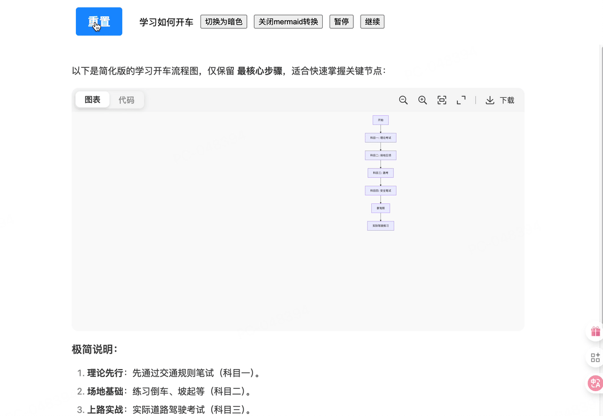
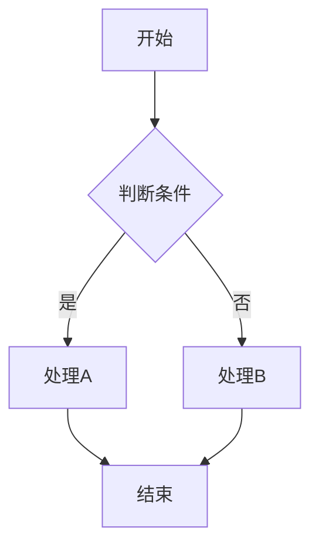
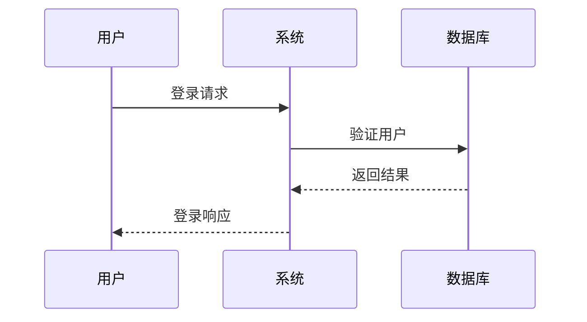
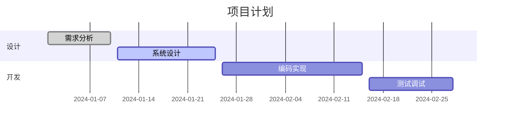
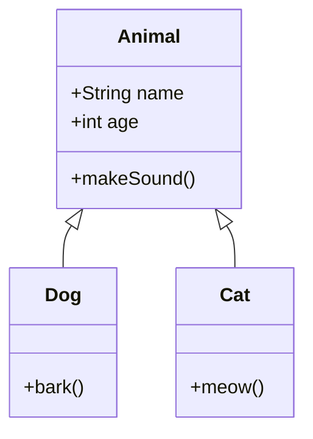
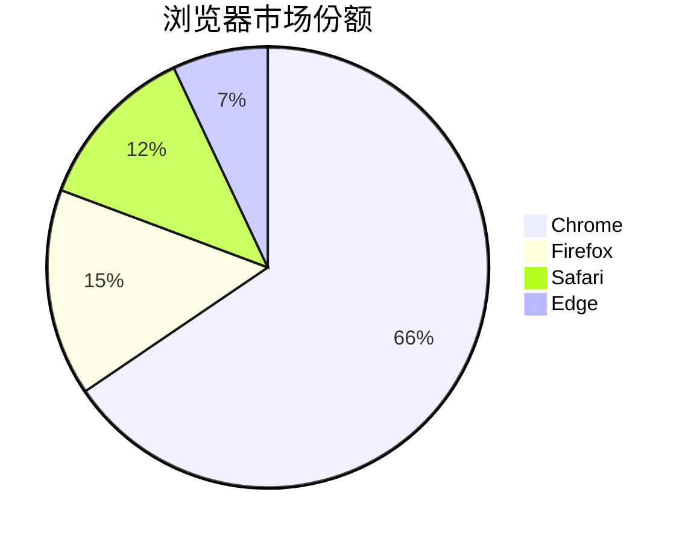
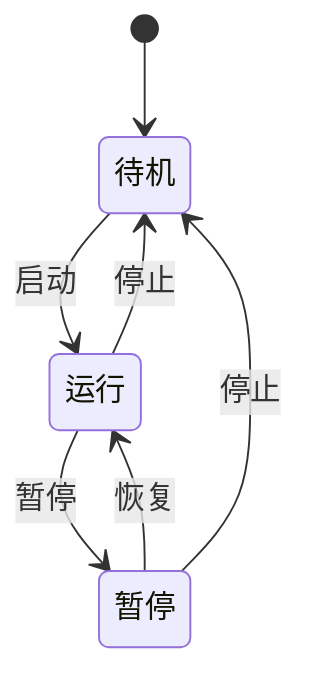

# ds-markdown-mermaid-plugin

一个为 [ds-markdown](https://github.com/onshinpei/ds-markdown) 提供 Mermaid 图表渲染功能的 React 插件。

[DEMO](https://stackblitz.com/edit/vitejs-vite-iqbyta3j?file=README.md)



## ✨ 特性

- 🎯 **简单易用** - 作为 ds-markdown 的插件，轻松集成
- 🎨 **主题支持** - 支持 Mermaid 的多种主题配置
- 📊 **图表类型** - 支持流程图、序列图、甘特图、类图、饼图、状态图等
- ⚡ **高性能** - 基于 Mermaid 11.x，渲染性能优秀
- 🔧 **可配置** - 支持自定义 Mermaid 配置选项

## 📦 安装

```bash
npm install ds-markdown-mermaid-plugin
```

或者使用 yarn：

```bash
yarn add ds-markdown-mermaid-plugin
```

## 🚀 快速开始

### 基本用法

```tsx
import React from 'react';
import { ConfigProvider, Markdown } from 'ds-markdown';
import plugin from 'ds-markdown-mermaid-plugin';
import 'ds-markdown/style.css';

const App = () => {
  const markdownContent = `
# 流程图示例

\`\`\`mermaid
flowchart TD
    A[开始] --> B{判断条件}
    B -->|是| C[处理A]
    B -->|否| D[处理B]
    C --> E[结束]
    D --> E
\`\`\`
`;

  return (
    <ConfigProvider>
      <Markdown plugins={[plugin]}>{markdownContent}</Markdown>
    </ConfigProvider>
  );
};

export default App;
```

### 配置 Mermaid 主题

```tsx
import React from 'react';
import { ConfigProvider, Markdown } from 'ds-markdown';
import plugin from 'ds-markdown-mermaid-plugin';
import 'ds-markdown/style.css';

const App = () => {
  const markdownContent = `
\`\`\`mermaid
sequenceDiagram
    participant 用户
    participant 系统
    participant 数据库

    用户->>系统: 登录请求
    系统->>数据库: 验证用户
    数据库-->>系统: 返回结果
    系统-->>用户: 登录响应
\`\`\`
`;

  // 配置 Mermaid
  const mermaidConfig = {
    flowchart: {
      useMaxWidth: true,
      htmlLabels: true,
    },
  };

  return (
    <ConfigProvider mermaidConfig={mermaidConfig}>
      <Markdown plugins={[plugin]}>{markdownContent}</Markdown>
    </ConfigProvider>
  );
};

export default App;
```

## 📊 支持的图表类型

### 流程图 (Flowchart)



### 序列图 (Sequence Diagram)



### 甘特图 (Gantt Chart)



### 类图 (Class Diagram)



### 饼图 (Pie Chart)



### 状态图 (State Diagram)



## 🔧 API 文档

### 插件导出

```tsx
import plugin from 'ds-markdown-mermaid-plugin';
```

### 组件导出

```tsx
import { MermaidBlock } from 'ds-markdown-mermaid-plugin';
```

## 📝 完整示例

查看 [example](./example/) 目录获取完整的使用示例。

### 运行示例

```bash
# 安装依赖
npm install

# 启动开发服务器
npm run dev

# 构建示例
npm run build:demo
```

## 📄 许可证

本项目基于 MIT 许可证开源 - 查看 [LICENSE](LICENSE) 文件了解详情。

## 🔗 相关链接

- [ds-markdown](https://github.com/onshinpei/ds-markdown) - 主项目
- [Mermaid](https://mermaid.js.org/) - 图表库
- [React](https://reactjs.org/) - UI 框架

## 📞 支持

如果你遇到任何问题或有任何建议，欢迎提issues
